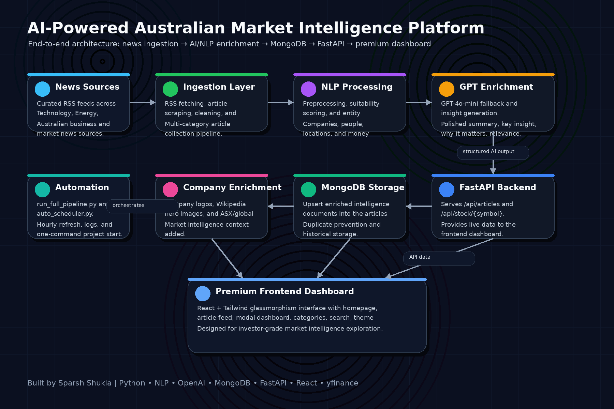
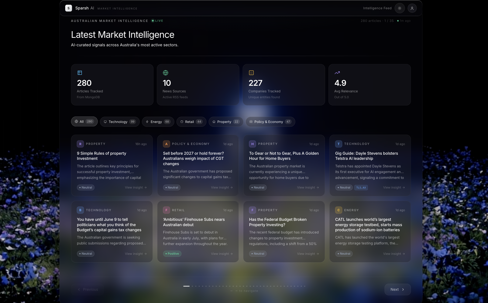
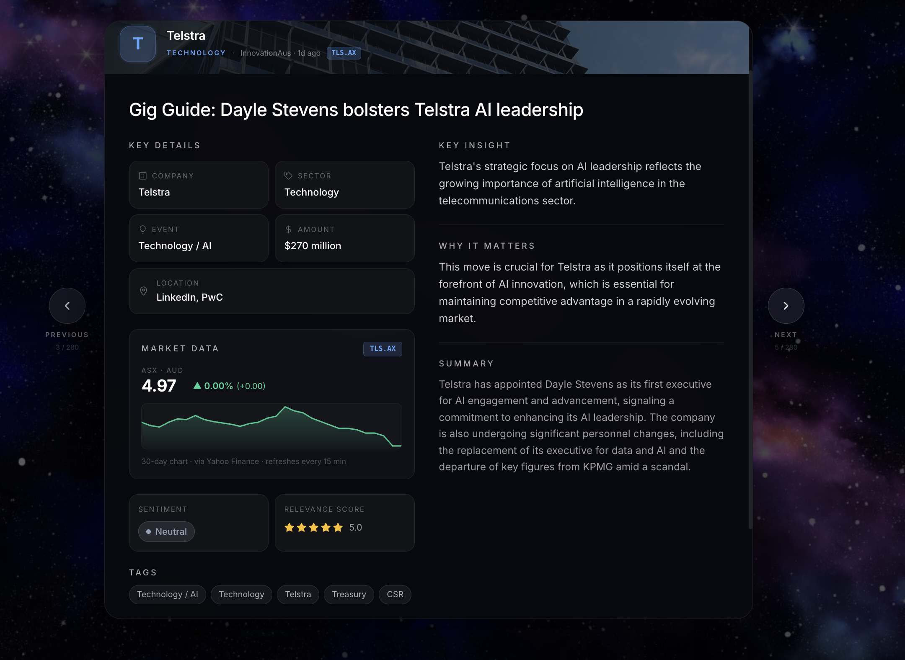

# 🇦🇺 Australian Market Intelligence


> A production-grade AI-powered market intelligence platform that continuously monitors Australian business news, extracts entities, scores relevance, and surfaces investment-grade insights across Technology, Energy, Retail, Property, and Policy sectors.

---

## Overview

Australian Market Intelligence is a full-stack data platform that transforms raw RSS news feeds into structured, enriched intelligence — similar in concept to Bloomberg Terminal or Exploding Topics, built for the Australian market.

The system runs an automated 8-step pipeline every hour, fetches articles from curated Australian news sources, applies NLP and GPT-4 enrichment, and serves the results through a premium glassmorphism web interface with live stock prices.

---
## 📊 Project Highlights

- 220+ enriched business articles processed and stored in MongoDB
- 5 Australian business sectors monitored (Technology, Energy, Retail, Property, Policy & Economy)
- 8-step automated intelligence pipeline from ingestion to enrichment
- Hybrid NER architecture using spaCy + GLiNER for entity extraction
- GPT-4o-mini powered insights including summaries, key insights, and "Why It Matters" analysis
- Real-time company enrichment with logos, stock symbols, and market context
- FastAPI backend serving intelligence and stock market data
- Interactive React dashboard with search, filtering, sentiment scoring, and stock visualization
- Automated hourly processing via scheduler-based pipeline execution
- MongoDB intelligence repository supporting incremental article updates and deduplication

---

## Features

### Intelligence Pipeline
- **Automated 8-step pipeline** — fetch → scrape → NLP → GPT enrichment → entity extraction → company enrichment → MongoDB storage → stock symbol patching
- **Multi-category support** — Technology, Energy, Retail, Property, Policy & Economy
- **Suitability scoring** — NLP-based relevance thresholds filter noise from signal
- **GPT-4o-mini enrichment** — polished summaries, key insights, "why it matters" analysis
- **Incremental processing** — only new articles trigger GPT calls; existing insights are preserved

### Data Enrichment
- **Entity extraction** — company names, people, locations, money amounts via GLiNER + spaCy
- **Stock symbol mapping** — 50+ ASX and global tickers mapped to detected companies
- **Wikipedia hero images** — real company photos fetched automatically from Wikipedia
- **Company logo resolution** — Clearbit-based logo URLs with letter-avatar fallback

### Frontend
- **Cinematic hero section** — full-screen video background with animated text
- **Horizontal article slider** — 8 articles per page, smooth Apple-grade transitions
- **Live stock integration** — real-time prices, 30-day sparklines via Yahoo Finance (yfinance)
- **Premium article modal** — two-column intelligence card with company hero image, stock chart, key insight, sentiment scoring
- **Dark/light theme** — two different cinematic video backgrounds
- **Live search** — filters across title, company, summary, source, and tags
- **Auto-refresh** — frontend silently re-fetches new articles every 5 minutes

### Backend API
- **FastAPI** — `/api/articles` serving all enriched articles from MongoDB
- **Stock endpoint** — `/api/stock/{symbol}` with 15-minute caching
- **CORS-enabled** — ready for any frontend origin
- **Category fallback images** — premium Unsplash images per category

---

## Tech Stack

| Layer | Technology |
|---|---|
| **Pipeline orchestration** | Python (custom `run_full_pipeline.py`) |
| **RSS fetching** | feedparser |
| **Web scraping** | trafilatura, BeautifulSoup4 |
| **NLP / NER** | spaCy, GLiNER, NLTK, TextBlob |
| **AI enrichment** | OpenAI GPT-4o-mini |
| **Database** | MongoDB |
| **API** | FastAPI + Uvicorn |
| **Market data** | yfinance (Yahoo Finance) |
| **Scheduling** | schedule |
| **Frontend** | React 18 (CDN), Tailwind CSS (CDN), Babel standalone |
| **Styling** | Glassmorphism, CSS animations, Unsplash/Wikipedia images |

---

## Architecture



```
┌─────────────────────────────────────────────────────────────┐
│                    AUTOMATED PIPELINE                       │
│                                                             │
│  RSS Feeds → Scraper → NLP → GPT-4o → Enrichment → MongoDB  │
│                                                             │
│  Step 1: Fetch (5 categories × N sources)                   │
│  Step 2: Entity Extraction (GLiNER + spaCy)                 │
│  Step 3: GPT Fallback (low-confidence articles)             │
│  Step 4: AI Insights (summaries, key insight, why it matters)│
│  Step 5: Company Enrichment (logos, stock symbols)          │
│  Step 6: MongoDB Upsert                                     │
│  Step 7: Stock Symbol Patch (all documents)                 │
│  Step 8: Wikipedia Hero Images                              │
└─────────────────────────────────────────────────────────────┘
         ↓
┌────────────────┐      ┌──────────────────────────────────┐
│   FastAPI      │      │         Frontend (React)         │
│  :8000         │◄────►│  localhost:3000 / index.html     │
│  /api/articles │      │  • Hero video section            │
│  /api/stock/   │      │  • Article slider (8/page)       │
└────────────────┘      │  • Premium modal + stock chart   │
         ↓              └──────────────────────────────────┘
┌────────────────┐
│    MongoDB     │
│  articles col  │
│  ~220 docs     │
└────────────────┘
```

---

## 📸 Screenshots

### Homepage


### Intelligence Dashboard



### Article Intelligence



## Setup

### Prerequisites
- Python 3.11+
- MongoDB running locally (`mongod`)
- OpenAI API key

### Installation

```bash
# 1. Clone the repository
git clone https://github.com/yourusername/australian-market-intelligence.git
cd australian-market-intelligence

# 2. Create virtual environment
python -m venv venv
source venv/bin/activate      # macOS/Linux
# venv\Scripts\activate       # Windows

# 3. Install dependencies
pip install -r requirements.txt

# 4. Download spaCy model
python -m spacy download en_core_web_sm

# 5. Configure environment
cp .env.example .env
# Edit .env with your OPENAI_API_KEY
```

### Running the Pipeline

```bash
# Run once (fetches all categories, enriches, stores to MongoDB)
PYTHONPATH=src python src/run_full_pipeline.py

# Run automatically every hour
PYTHONPATH=src python src/auto_scheduler.py

# Custom interval (e.g. every 2 hours)
PIPELINE_INTERVAL_HOURS=2 PYTHONPATH=src python src/auto_scheduler.py
```

### Running the API + Frontend

```bash
# Start FastAPI backend
cd src
uvicorn api:app --port 8000

# Serve frontend (in a separate terminal)
cd frontend
python -m http.server 3000

# Open in browser
open http://localhost:3000
```

---

## Project Structure

```
australian_market_intelligence/
├── src/
│   ├── main.py                      # Single-category pipeline (interactive)
│   ├── run_all_categories.py        # Multi-category fetch
│   ├── run_full_pipeline.py         # Master orchestrator (8 steps)
│   ├── auto_scheduler.py            # Hourly scheduler
│   ├── source_config.py             # RSS feed configuration
│   ├── rss_fetcher.py               # RSS fetching
│   ├── scraper.py                   # Article scraping
│   ├── enrich_articles.py           # NER entity extraction
│   ├── apply_gpt_fallback.py        # GPT for low-confidence articles
│   ├── enrich_all_articles.py       # GPT insights generation
│   ├── company_enrichment.py        # Logos + stock symbols
│   ├── company_image_enrichment.py  # Wikipedia hero images
│   ├── patch_stock_symbols.py       # MongoDB-wide ticker patch
│   ├── mongodb_storage.py           # MongoDB upsert
│   ├── api.py                       # FastAPI backend
│   └── nlp/
│       ├── pipeline.py              # NLP preprocessing
│       ├── entity_extractor.py      # GLiNER + spaCy NER
│       ├── gpt_fallback.py          # OpenAI GPT enrichment
│       ├── intelligence_scoring.py  # Relevance + sentiment scoring
│       └── suitability.py           # Article suitability filter
├── frontend/
│   └── index.html                   # Full React SPA (CDN-based)
├── .env.example                     # Environment variable template
├── .gitignore
├── requirements.txt
└── README.md
```

---

## Data Sources

| Category | Sources |
|---|---|
| Technology | InnovationAus, Startup Daily, IT News |
| Energy | RenewEconomy, PV Magazine Australia |
| Retail | Inside Retail |
| Property | The Property Tribune, Property Update |
| Policy & Economy | SBS News Australia, The Australia Institute |

---

## Future Roadmap

- [ ] Docker + docker-compose for one-command deployment
- [ ] Deploy to cloud (AWS / GCP / Railway)
- [ ] Replace `localhost:8000` with configurable `API_BASE_URL`
- [ ] PM2 / systemd process manager for always-on operation
- [ ] Real-time WebSocket updates (push new articles to browser)
- [ ] `/api/refresh` endpoint to trigger pipeline from UI
- [ ] Expand stock symbol coverage via fuzzy company matching
- [ ] Add more Australian data sources (AFR, The Australian, ABC)
- [ ] User authentication + personalised watchlists
- [ ] Email digest / Slack alerts for high-relevance articles

---

## Author

**Sparsh Shukla**  
Data Scientist & Full-Stack Developer  
📧 sparshshukla97@gmail.com

---

## License

enjoy people 
SS97
